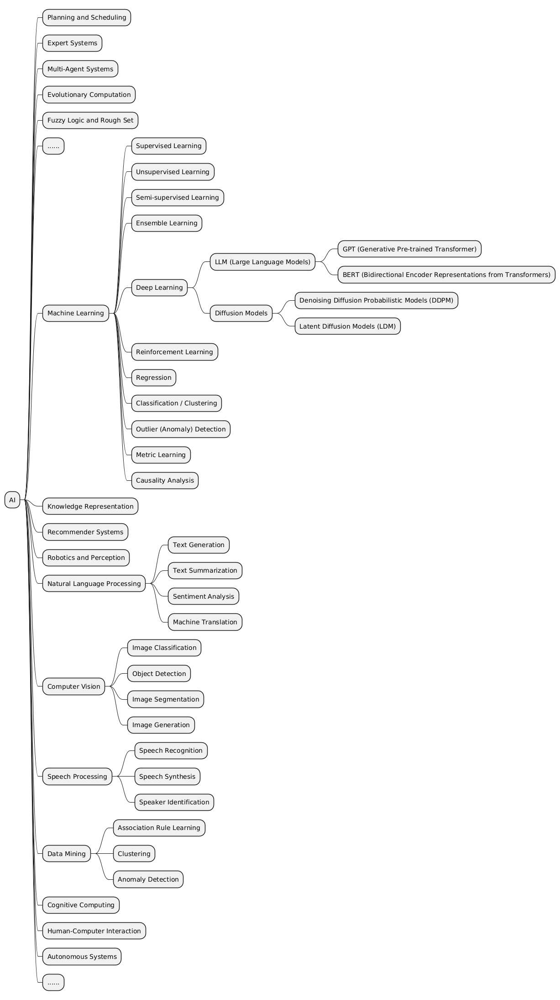

# Day 01: 大致介紹,數理跟ＭＬ基礎,短課程和side project實作

# 目錄

- [參賽目的](#參賽目的)
- [AI簡介](#AI簡介)
- [數理基礎概略](#數理基礎概略)
- [機器學習概略](#機器學習概略)
- [兩DLAI短課程實作](#兩DLAI短課程實作)
- [醫療Chatbot實作內容](#醫療Chatbot實作內容)

## 參賽目的

參加這次為期30天的部落格挑戰，主要目的是建立一個個人的LLM和深度學習（DL）知識庫，以及完成數個小型的side project。這將有助於我快速復習已掌握的知識，同時也能夠快速分類、吸收和內化新知識，並將其付諸實踐。此外，這個知識筆記還能方便他人了解目前LLM相關技術的進展，並使用筆記中的流程和程式碼生成自己的應用。
目前，這個知識庫的內容將圍繞深度學習、大模型、Agent等相關主題。這次挑戰的目的是深入探索LLM的各個方面，並通過實際專案應用這些知識，提升我的技術能力並分享我的學習成果。
每一天的內容將展示我實作和添加的過程。
目前暫定的內容

1. AI工程師大補帖
1-1 LLM課程擴展與添加 主要內容將基於https://github.com/mlabonne/llm-course 進行延伸和添加，涵蓋從基礎概念到進階應用的全面介紹。我將深入解析該課程中的重點，並補充更多實際案例和應用技巧。
1-2 deeplearning.ai 上的短課程以及轉化的實作 參考 deeplearning.ai 上所有的短課程內容，這些課程將涵蓋最新的AI技術和工具，包括但不限於以下主題：
    • 語言模型的預訓練和微調
    • 高效提示工程
    • 多模態檢索和生成應用
    • LLM在邊緣設備上的部署
    • 強化學習和人類反饋
1-3 論文閱讀 在挑戰期間，我將閱讀並分析兩篇重要的LLM相關論文，分享其中的關鍵發現和應用。
1-4 Stable Diffusion相關內容 探索和應用Stable Diffusion技術，深入理解其在圖像生成和處理方面的應用。
1-5 其他生成式AI相關的內容
2. 數個小 side project
我將設計並實作以下數個與LLM相關的實際專案：
    • 醫療聊天機器人：利用LLM技術開發一個能夠回答醫療相關問題的聊天機器人，目的是提供精確且即時的醫療資訊輔助。
    • 代碼LLM程式插件：開發一個能夠輔助編寫和調試代碼的程式插件，提升開發效率和代碼質量。
    • RPA + LLM：結合機器人流程自動化（RPA）和LLM技術，設計一個自動化工作流程系統，提升企業的運營效率。
期待成果
通過這次挑戰，我希望能夠更加深入掌握LLM以及生成式AI的技術及其應用，並完成三個具有實際價值的專案。此外，我將通過閱讀並理解關鍵論文，掌握從論文閱讀、程式碼理解到吸收內化和產生新題目的整個過程。

## AI簡介

什麼是人工智慧（AI）？

人工智慧（Artificial Intelligence, AI）廣義上指的是讓機器展現類似人類智能的技術。這些技術讓機器能感知環境、學習、推理、決策、甚至創作。AI並非單一技術，而是涵蓋多種技術與方法的廣泛領域。

AI的目標

AI的終極目標是創造出具備通用智能的機器，能像人類一樣思考、學習和解決各種問題。然而，目前AI發展仍處於弱人工智慧（Narrow AI）階段，即只能在特定任務上展現出卓越能力，例如：

圖像識別：分辨照片中的物體、人臉辨識
語音辨識：將語音轉換為文字、語音助理（如Siri、Alexa）
自然語言處理：機器翻譯、聊天機器人、文本生成
推薦系統：電商平台的商品推薦、影音平台的內容推薦
棋類遊戲：AlphaGo在圍棋上的勝利
醫療診斷：輔助醫師判讀醫學影像、預測疾病風險
AI的分類

AI的分類方式有很多種，以下介紹幾種常見的分類：

1. 基於能力的分類

弱人工智慧（Narrow AI/Weak AI）：
專注於特定任務，無法處理超出設計範圍的問題。
目前大多數AI應用都屬於此類，如圖像識別、語音辨識等。
強人工智慧（Strong AI/General AI）：
具備與人類相當或超越人類的智能，能像人類一樣思考、學習和解決各種問題。
目前仍處於理論和研究階段，尚未實現。
不過目前隨折chatgpt的崛起，我覺得可能在這幾年就可能有很多接近強甚至是超人工智能的模型出現。
超人工智慧（Super AI）：
智能超越人類，能解決人類無法解決的問題。
屬於科幻小說和電影中的概念，目前沒有科學依據。

2. 基於技術的分類

機器學習（Machine Learning）：
從數據中學習，並根據學習到的知識做出預測或決策。
常見的機器學習方法包括監督式學習、非監督式學習和強化學習。
深度學習（Deep Learning）：
機器學習的一個分支，使用多層神經網路來學習數據的複雜表示。
在圖像識別、語音辨識和自然語言處理等領域取得了重大突破。
自然語言處理（Natural Language Processing, NLP）：
讓機器理解、處理和生成人類語言。
包括機器翻譯、文本摘要、情感分析、聊天機器人等。
計算機視覺（Computer Vision）：
讓機器理解和解釋視覺信息，如圖像和影片。
包括圖像分類、物體檢測、圖像分割、人臉辨識等。
專家系統（Expert Systems）：
模擬人類專家的知識和經驗來解決特定領域的問題。
通常使用規則和推理引擎來表示知識和進行決策。
機器人學（Robotics）：
結合AI、機械工程和計算機科學，設計和製造機器人。
機器人可以執行各種任務，如工業製造、醫療手術、家庭服務等。
### 人工智慧（AI）的發展歷史

當然，很樂意為您提供更詳細的AI發展歷史：

**人工智慧發展詳史**

人工智慧的發展史宛如一幅波瀾壯闊的畫卷，交織著科學家的夢想、技術的突破，以及對未來世界的無限想像。讓我們一同深入探索這段充滿挑戰與驚喜的旅程。

**1950s-1960s：AI的誕生與樂觀探索**

- **思想萌芽**：
    - 1943年，沃倫·麥卡洛克（Warren McCulloch）和沃爾特·皮茨（Walter Pitts）提出「人工神經元」模型，奠定了神經網路的基礎。
    - 艾倫·圖靈的圖靈測試，為評估機器智能提供了一個重要標準。
- **達特茅斯會議與AI的誕生**：
    - 1956年，約翰·麥卡錫（John McCarthy）、馬文·閔斯基（Marvin Minsky）等人在達特茅斯學院舉辦研討會，首次提出「人工智慧」一詞，並確立了AI研究的目標。
- **早期樂觀與探索**：
    - 研究者們對AI充滿信心，認為在幾十年內就能實現通用人工智慧（AGI）。
    - 邏輯理論家（Logic Theorist）程式成功證明了數學原理，振奮了研究界的士氣。
    - 然而，早期的AI系統多為基於規則的系統，缺乏學習和適應能力。

**1970s-1980s：知識為本的專家系統與第一次寒冬**

- **知識表示與推理**：
    - 研究者們致力於將人類知識表示成計算機可理解的形式，並開發推理引擎來模擬專家決策。
    - 語義網路（Semantic Network）、框架（Frame）等知識表示方法應運而生。
- **專家系統的輝煌與衰落**：
    - MYCIN在診斷血液感染方面表現出色，DENDRAL則成功應用於化學分析。
    - 然而，專家系統的局限性逐漸顯現：知識獲取困難、系統僵化、無法處理不確定性。
- **第一次AI寒冬**：
    - 過高的期望與現實的落差，導致研究經費削減，AI進入第一次寒冬。

**1990s：機器學習的崛起與第二次寒冬**

- **機器學習的新浪潮**：
    - 統計學習方法（如貝葉斯網路、隱馬爾可夫模型）逐漸取代基於規則的系統。
    - 支援向量機（SVM）在分類問題上展現出強大能力。
- **神經網路的低潮**：
    - 雖然反向傳播演算法在80年代末被提出，但受限於計算能力和數據量，神經網路的發展相對緩慢。
- **第二次AI寒冬**：
    - 1990年代中期，AI再次因未能達到預期而陷入低谷。

**2000s：大數據與深度學習的曙光**

- **大數據時代來臨**：
    - 互聯網的發展帶來海量數據，為機器學習提供了充足的訓練資料。
    - 雲端計算和GPU加速技術也為AI發展提供了強大的計算能力。
- **深度學習的復興**：
    - 2006年，傑弗裡·辛頓（Geoffrey Hinton）等人提出深度置信網路（DBN），開啟了深度學習的新時代。
    - 2012年，AlexNet在ImageNet圖像識別比賽中取得突破性成果，深度學習開始廣受關注。

**2010s至今：AI的黃金時代與未來展望**

- **深度學習的全面開花**：
    - 深度學習在各領域取得重大突破，如AlphaGo戰勝人類圍棋冠軍、GPT-3展現驚人的語言生成能力。
    - 生成對抗網路（GAN）在圖像生成、風格轉換等方面展現出強大潛力。
- **AI的廣泛應用**：
    - AI已深入各行各業，如醫療診斷、金融風控、自動駕駛、智慧城市等。
- **挑戰與未來**：
    - AI的可解釋性、公平性、倫理問題仍待解決。
    - 未來，AI將持續發展，並在更多領域帶來創新與變革。

人工智慧的發展史是一段充滿起伏的旅程，從早期的樂觀探索到兩次寒冬，再到如今的蓬勃發展，AI不斷超越自我，為人類社會帶來無限可能。未來，我們期待AI在更多領域發揮其潛力，同時也需要關注其發展帶來的各種挑戰，共同創造一個更美好的AI未來。
---------------

這邊主要是根據LLM course上面的目錄為基礎的加深以及補強。

## 數理基礎概略
(1.Mathematics for Machine Learning)

1.線性代數

2.微積分

3.機率與統計

## 機器學習概略
(2.Python for Machine Learning)
1.Pyothn 基礎

2.資料科學庫

3.資料處理

4.機器學習庫

## 兩DLAI短課程實作

1.ChatGPT Prompt Engineering for Developers

2.Building Systems with the ChatGPT API

## 醫療Chatbot實作內容

1.簡單但不成功也未完成的問答 demo

2.survey