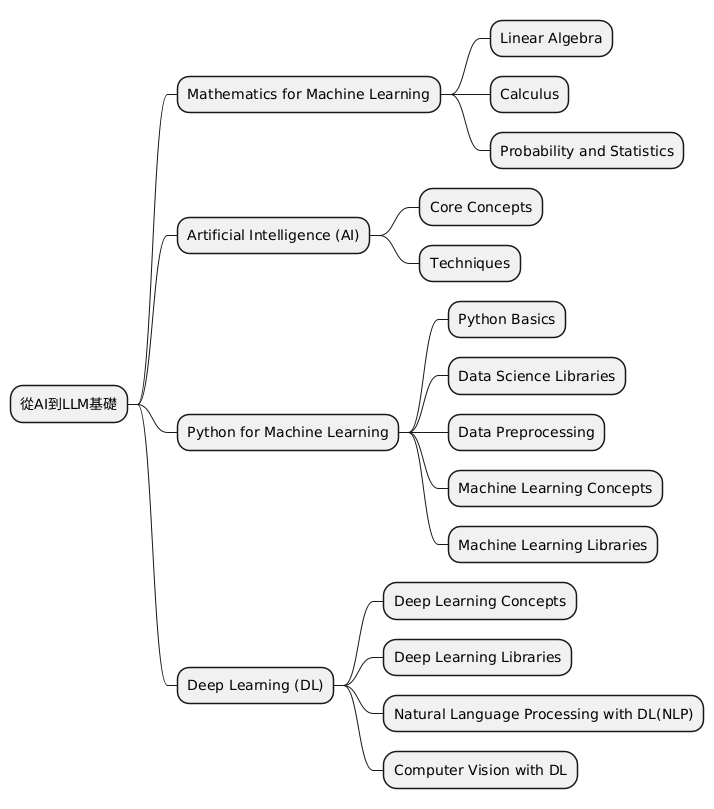
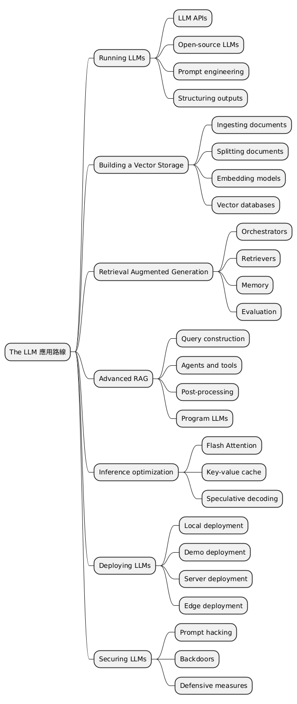

# 我的 AI學習相關筆記
## 相關的框架以及算法學習
0. [使用 Python 進行 ETL的流程](https://github.com/markl-a/My-AI-Learning-Notes/blob/main/1.%E5%BE%9EAI%E5%88%B0LLM%E5%9F%BA%E7%A4%8E/1.AI%2CML/%E4%BD%BF%E7%94%A8_Python_%E9%80%B2%E8%A1%8C%E7%AE%A1%E9%81%93_ETL.ipynb)
1. [python快速入門](https://github.com/markl-a/My-AI-Engineer-s-Notes/blob/main/1.%E5%BE%9EAI%E5%88%B0LLM%E5%9F%BA%E7%A4%8E/1.AI%2CML/1.%E5%BF%AB%E9%80%9F%E5%85%A5%E9%96%80python.ipynb)
2. [numpy,pandas學習紀錄](https://github.com/markl-a/My-AI-Engineer-s-Notes/blob/main/1.%E5%BE%9EAI%E5%88%B0LLM%E5%9F%BA%E7%A4%8E/1.AI%2CML/2.Python%E7%9A%84%EF%BC%AD%EF%BC%AC%E7%9B%B8%E9%97%9C%E6%A8%A1%E5%A1%8A%E5%A5%97%E4%BB%B6%E4%BD%BF%E7%94%A8.ipynb)
3. [tensorflow 學習紀錄](https://github.com/markl-a/My-AI-Engineer-s-Notes/tree/main/1.%E5%BE%9EAI%E5%88%B0LLM%E5%9F%BA%E7%A4%8E/2.DL%2CMLOps/01.DL-Tensorflow2)
4. [keras 學習紀錄](https://github.com/markl-a/My-AI-Engineer-s-Notes/blob/main/1.%E5%BE%9EAI%E5%88%B0LLM%E5%9F%BA%E7%A4%8E/2.DL%2CMLOps/02.DL-Keras3/1.ANN/ANN.ipynb)
5. [pytorch 學習紀錄](https://github.com/markl-a/My-AI-Engineer-s-Notes/tree/main/1.%E5%BE%9EAI%E5%88%B0LLM%E5%9F%BA%E7%A4%8E/2.DL%2CMLOps/03.DL-Pytorch)
6. [yolo 使用](https://github.com/markl-a/My-AI-Engineer-s-Notes/blob/main/1.%E5%BE%9EAI%E5%88%B0LLM%E5%9F%BA%E7%A4%8E/2.DL%2CMLOps/04.CV-Ultralytics/1.yolo8%E7%89%A9%E4%BB%B6%E5%81%B5%E6%B8%AC/1.train/how_to_auto_train_yolov8_model_with_autodistill%E4%BF%AE%E6%94%B9%E7%89%88.ipynb)
7. [galore的嘗試以及medical chat(這個版本還有很多要修改)](https://github.com/markl-a/My-AI-Engineer-s-Notes/tree/main/2.%E6%B7%B1%E5%85%A5LLM%E6%A8%A1%E5%9E%8B%E5%B7%A5%E7%A8%8B%E8%88%87LLM%E9%81%8B%E7%B6%AD)
8. [langchain 相關的學習紀錄](https://github.com/markl-a/My-AI-Engineer-s-Notes/tree/main/3.LLM%E6%87%89%E7%94%A8%E5%B7%A5%E7%A8%8B/1.LangchainDemos)
9. [MLflow 入門介紹](https://github.com/markl-a/My-AI-Learning-Notes/blob/main/1.%E5%BE%9EAI%E5%88%B0LLM%E5%9F%BA%E7%A4%8E/2.DL%2CMLOps/05.MLOPS-MLFlow/MLFLOW%E5%85%A5%E9%96%80%E4%BB%8B%E7%B4%B9%EF%BC%9A%E9%80%9A%E9%81%8ECOLAB%2C%20NGROK%2C%20PYCARET.ipynb)

# 目錄

- [簡介](#簡介)
- [算法與資料結構](#算法與資料結構)
- [從AI到LLM基礎](#從ai到llm基礎)
- [深入LLM模型工程與LLM運維](#深入llm模型工程與llm運維)
- [LLM應用工程](#llm應用工程)
- [相關的更新Blog](#相關的更新blog)
- [DeepLearningAI短課程學習紀錄](#deeplearningai短課程學習紀錄)


## 簡介

這個 Notes 主要是我自己對於AI工程師相關的知識以及技能的了解與整理，主要的目錄是根據[llm-course](https://github.com/mlabonne/llm-course)進行延伸以及擴展，並加上一些AI, ML, DL以及一些資料分析相關的必備知識與技能整理。

不過目前會是以LLM為主，除了我之前就弄過的相關內容之外，其他的內容會是必須的才會被添加。

## 算法與資料結構

這邊主要會是我算法提練習的紀錄以及閱讀的心得，因為我不是大學教授或專家等級的，所以目前難免會有點錯誤。

之後補上專業的相關內容以及實作心得。

我算法題練習的倉庫:[LeetcodePractice](https://github.com/markl-a/LeetcodePractice)

## 從AI到LLM基礎

這邊主要是根據 LLM course 上面的目錄為基礎的加深以及補強。

主要內容為數學基礎,資料分析跟處理,機器學習,深度學習中的 NLP 以及 CV 和 MLOps

(為原內容再加深之外再加上CV 跟 MLOps等工作上可能會用到的內容)

之後再新增[ChatGPT for Data Analytics : Full Course](https://youtu.be/uhyMqbZI6rM?si=ebSO8H07ELUZn57z)的學習紀錄跟內容。

<details>
<summary>點擊以打開詳細內容</summary>



### 1. 機器學習數學基礎

在掌握機器學習之前，了解支撐了這些演算法的基本數學概念非常重要。不過其實大概看這三個影片課程大概就可以了，這一系列的影片教學有教學跟實作，其他的就有興趣再看。

1.線性代數:[Linear Algebra for Machine Learning](https://www.youtube.com/playlist?list=PLRDl2inPrWQW1QSWhBU0ki-jq_uElkh2a)

這對於理解許多演算法至關重要，尤其是深度學習中使用的演算法。關鍵概念包括向量、矩陣、行列式、特徵值和特徵向量、向量空間和線性變換。
  
2.微積分:[Calculus for Machine Learning ](https://www.youtube.com/playlist?list=PLRDl2inPrWQVu2OvnTvtkRpJ-wz-URMJx)

許多機器學習演算法涉及連續函數的最佳化，這需要了解導數、積分、極限和級數。另外多變量微積分和梯度的概念也很重要。
 
3.機率與統計:[Probability for Machine Learning ](https://www.youtube.com/playlist?list=PLRDl2inPrWQWwJ1mh4tCUxlLfZ76C1zge)

這些對於理解模型如何從數據中學習並做出預測至關重要。 關鍵概念包括機率論、隨機變數、機率分佈、期望、變異數、協方差、相關性、假設檢定、信賴區間、最大似然估計和貝葉斯推理。

<details>
<summary>點擊以打開可延伸的閱讀以及參考連結：</summary>
  
</br>
可延伸的閱讀以及參考：

</br>

電子書：

- [深度學習中的數學](https://github.com/jash-git/Jash-good-idea-20200304-001/blob/master/CN%20AI%20book/%E6%B7%B1%E5%BA%A6%E5%AD%A6%E4%B9%A0%E7%9A%84%E6%95%B0%E5%AD%A6.pdf)

- [深度學習基礎以及數學原理](https://github.com/HaoMood/File/blob/master/%E6%B7%B1%E5%BA%A6%E5%AD%A6%E4%B9%A0%E5%9F%BA%E7%A1%80%E5%8F%8A%E6%95%B0%E5%AD%A6%E5%8E%9F%E7%90%86.pdf)

其他相關連結：

- [動手深度學習-中的預備知識那章](https://zh-v2.d2l.ai/d2l-zh-pytorch.pdf)
- [動手深度學習這本書也能讓一般人大致上了解深度學習的運作](http://zh.gluon.ai/chapter_introduction/deep-learning-intro.html)
- [Blog- 深度學習(Deep Learning)-數學整理](https://dysonma.github.io/2021/01/27/%E6%B7%B1%E5%BA%A6%E5%AD%B8%E7%BF%92-Deep-Learning-%E6%95%B8%E5%AD%B8%E6%95%B4%E7%90%86/)
- [Blog- 機器/深度學習-基礎數學篇(一)(內容跟上面雷同)](https://chih-sheng-huang821.medium.com/%E6%A9%9F%E5%99%A8%E5%AD%B8%E7%BF%92-%E5%9F%BA%E7%A4%8E%E6%95%B8%E5%AD%B8%E7%AF%87-%E4%B8%80-1c8337179ad6)
- [我是如何學習深度學習中的數學的？(可參考方法)](https://yanwei-liu.medium.com/%E6%88%91%E6%98%AF%E5%A6%82%E4%BD%95%E5%AD%B8%E7%BF%92%E6%B7%B1%E5%BA%A6%E5%AD%B8%E7%BF%92%E4%B8%AD%E7%9A%84%E6%95%B8%E5%AD%B8%E7%9A%84-a26eee623638)

- [深度學習經典(花書)](https://github.com/ytin16/awesome-machine-learning-1/blob/master/Deep-Learning%E8%8A%B1%E4%B9%A6-%E3%80%8A%E6%B7%B1%E5%BA%A6%E5%AD%A6%E4%B9%A0%E3%80%8B-%E4%B8%AD%E6%96%87%E7%89%88.pdf)

- [深度學習經典(花書)中的數學推導](https://github.com/MingchaoZhu/DeepLearning)

- [繁中的深度學習中的數學相關資料](https://hackmd.io/@changken/rkukooSGS#%E6%A9%9F%E5%99%A8%E5%AD%B8%E7%BF%92%E5%8F%8A%E6%B7%B1%E5%BA%A6%E5%AD%B8%E7%BF%92%E7%9A%84%E8%B3%87%E6%96%99)
- [用 Python 學微積分](https://ryancheunggit.gitbooks.io/calculus-with-python/content/01Functions.html)
- [機器學習的數學基礎：矩陣篇](http://www.hahack.com/math/math-matrix/)
- [機器學習的數學基礎：向量篇](http://www.hahack.com/math/math-vector/)
- [機器學習的數學基礎：線性代數進階篇](http://www.hahack.com/math/math-linear-algebra-graded/)
- [Python for Probability, Statistics, and Machine Learning](https://github.com/unpingco/Python-for-Probability-Statistics-and-Machine-Learning)
- [Think Bayes](https://greenteapress.com/wp/think-bayes/)
- [統計分佈 方開泰教授 王元教授](http://item.jd.com/12019664.html)
- [概率論與數理統計 陳希孺教授](https://www.amazon.cn/dp/B073LBYPZ4/ref=sr_1_1?ie=UTF8&qid=1546071311&sr=8-1&keywords=陈希儒)
- [Linear Regression in Python with Scikit-Learn](https://stackabuse.com/linear-regression-in-python-with-scikit-learn/)
- [線性代數自學課程，國內外學習資源](https://selflearningsuccess.com/linear-algebra-courses/#Mathematics_for_Machine_Learning_Linear_Algebra): 本文彙整國內外線性代數自學課程，提供給規劃學習線性代數的朋友們參考。
- [3Blue1Brown - 線性代數的本質](https://www.youtube.com/watch?v=fNk_zzaMoSs&list=PLZHQObOWTQDPD3MizzM2xVFitgF8hE_ab): 此系列的影片介紹幾何相關的概念
- [StatQuest with Josh Starmer - 統計基礎知識](https://www.youtube.com/watch?v=qBigTkBLU6g&list=PLblh5JKOoLUK0FLuzwntyYI10UQFUhsY9): 為許多統計概念提供簡單明了的解釋。
- [Aerin女士的AP統計直觀理解](https://automata88.medium.com/list/cacc224d5e7d): 提供每個機率分佈背後的Medium文章清單。
- [沉浸式線性代數](https://immersivemath.com/ila/learnmore.html): 線性代數的另一種圖像化詮釋.
- [Khan Academy - 線性代數](https://www.khanacademy.org/math/linear-algebra): 非常適合初學者，因為它以非常直觀的方式解釋了概念。
- [Khan Academy - 微積分](https://www.khanacademy.org/math/calculus-1): 一門涵蓋微積分所有基礎知識的互動課程。
- [Khan Academy - 機率與統計](https://www.khanacademy.org/math/statistics-probability): 以易於理解的格式提供材料。
---
</details>

### 2. AI簡介

- **AI大致的歷史跟介紹**:
    - [人工智慧史-維基百科](https://zh.wikipedia.org/zh-tw/%E4%BA%BA%E5%B7%A5%E6%99%BA%E8%83%BD%E5%8F%B2)
    - [人工智慧到生成式AI的發展(2010 ~2024)](https://github.com/markl-a/My-AI-Engineer-s-Notes/blob/main/1.%E5%BE%9EAI%E5%88%B0LLM%E5%9F%BA%E7%A4%8E/1.AI%2CML/%E4%BA%BA%E5%B7%A5%E6%99%BA%E6%85%A7%E5%88%B0%E7%94%9F%E6%88%90%E5%BC%8FAI%E7%9A%84%E7%99%BC%E5%B1%95(2010%20~2024).md)

- **AI課程推薦**:

    -  這邊我推薦大致可以通過這個課程入門AI:
        [Harvard CS50’s Artificial Intelligence with Python – Full University Course](https://youtu.be/5NgNicANyqM?si=yTbD-6wCbPYzsCVL)

        下面的課程在學完之後也可以參考下，不過基本上面那個應該就足夠了。

        [General Intro | Stanford CS221: Artificial Intelligence: Principles and Techniques (Autumn 2021)](https://youtu.be/ZiwogMtbjr4?si=1KUL6JkiQE7qyiju)

        [MIT 6.034 Artificial Intelligence, Fall 2010](https://youtu.be/TjZBTDzGeGg?si=9qV18PmDo9i63Qxsu)

        可以從上面的內容發現，隨著時間的演變，這些基礎學科的內容著重的部分其實也有很多改變，所以要學的話大概也就學自己需要的就可以了。

### 3. 機器學習與Python

Python 是一種強大而靈活的程式語言，由於其可讀性、一致性和強大的資料科學庫生態系統，特別適合機器學習。


- **Python基礎**: Python程式設計需要很好地理解基本語法、資料類型、錯誤處理和物件導向程式設計。
    -  推薦閱讀,應用-[Python自學從哪開始？線上免費資源一次告訴你！](https://blog.luckertw.com/python-learning/)
    - 其實去 freecode camp 練下大概就可以了，程式語言只要會C ,C++的話，除了彙編語言或verilog這類的語言之外其他的語言就不會相差太多。
    - 在弄清楚基本的原理後，實作的項目可參考: [Project-based-learning](https://github.com/practical-tutorials/project-based-learning?tab=readme-ov-file#python)
- **資料科學函式庫**: 包括熟悉用於數值運算的 NumPy、用於資料操作和分析的 Pandas、用於資料視覺化的 Matplotlib 和 Seaborn。
    -  推薦閱讀,應用-[Data Analysis with Python - Full Course for Beginners (Numpy, Pandas, Matplotlib, Seaborn)](https://youtu.be/r-uOLxNrNk8?si=vHI8UVb-CvwmPgzY)
- **資料預處理**: 這涉及特徵縮放和標準化、處理缺失資料、異常值檢測、分類資料編碼以及將資料拆分為訓練集、驗證集和測試集。
    -  推薦閱讀,應用- 概覽[[資料分析&機器學習] 第2.4講：資料前處理(Missing data, One-hot encoding, Feature Scaling)](https://medium.com/jameslearningnote/%E8%B3%87%E6%96%99%E5%88%86%E6%9E%90-%E6%A9%9F%E5%99%A8%E5%AD%B8%E7%BF%92-%E7%AC%AC2-4%E8%AC%9B-%E8%B3%87%E6%96%99%E5%89%8D%E8%99%95%E7%90%86-missing-data-one-hot-encoding-feature-scaling-3b70a7839b4a)
    -  推薦閱讀,應用-[[機器學習筆記]數據預處理](https://doremi31618.medium.com/%E6%A9%9F%E5%99%A8%E5%AD%B8%E7%BF%92%E7%AD%86%E8%A8%98-%E6%95%B8%E6%93%9A%E9%A0%90%E8%99%95%E7%90%8601-ae90853978da)
- **機器學習課程**:[Machine Learning in 2024 – Beginner's Course](https://youtu.be/bmmQA8A-yUA?si=_2Ga-3WKdar_80fj)
- **機器學習函式庫**: 熟練使用 Scikit-learn（一個提供多種監督和非監督學習演算法的函式庫）至關重要。了解如何實現線性迴歸、邏輯迴歸、決策樹、隨機森林、k 最近鄰 (K-NN) 和 K 均值聚類等演算法非常重要。PCA 和 t-SNE 等降維技術也有助於視覺化高維度資料。
    -  推薦閱讀,應用(裡面有ipynb)-[Scikit-learn Crash Course - Machine Learning Library for Python](https://www.youtube.com/watch?v=0B5eIE_1vpU&t=240s)
    -  推薦閱讀,應用(裡面有ipynb)-[Python for Data Science Course – Hands-on Projects with EDA, AB Testing & Business Intelligence](https://youtu.be/FTpmwX94_Yo?si=6ctmP5mvrXas88y4)


📚 資源：

- [Python 資料科學手冊(裡面有ipynb ,colab)](https://jakevdp.github.io/PythonDataScienceHandbook/)
- [Real Python](https://realpython.com/): 綜合資源，包含初學者和進階 Python 概念的文章和教學。
- [freeCodeCamp - 學習 Python](https://www.youtube.com/watch?v=rfscVS0vtbw): 長影片，完整介紹了 Python 中的所有核心概念。
- [Python 資料科學手冊](https://jakevdp.github.io/PythonDataScienceHandbook/): 免費的數位書籍，是學習 pandas、NumPy、Matplotlib 和 Seaborn 的絕佳資源。
- [freeCodeCamp - 適合所有人的機器學習](https://youtu.be/i_LwzRVP7bg): 為初學者介紹不同的機器學習演算法。
- [Udacity - 機器學習簡介](https://www.udacity.com/course/intro-to-machine-learning--ud120): 免費課程，涵蓋 PCA 和其他幾個機器學習概念。

---
### 4. 神經網絡,深度學習與自然語言處理(NLP)和電腦視覺(CV)

- **基礎知識**: 這包括理解神經網路的結構，例如層、權重、偏差和激活函數（sigmoid、tanh、ReLU 等）
    - [3Blue1Brown - 什麼是神經網路？](https://www.youtube.com/watch?v=aircAruvnKk): 該影片直觀地解釋了神經網路及其內部運作原理。
- **深度學習框架**: 目前是在深度學習框架方面還是 Pytorch 最熱門，但是有些老應用跟某些 Google 相關的應用仍還是使用 Tensorflow 。假如要入門的話建議下面四個連結找一個入門並實作一個應用即可。
    - [freeCodeCamp - 深度學習速成課程](https://www.youtube.com/watch?v=VyWAvY2CF9c): 此影片簡潔地介紹了深度學習中所有最重要的概念。
    - [動手深度學習官網](https://zh.d2l.ai/chapter_linear-networks/index.html)
    - [動手深度學習包含 tensorflow,pytorch 程式碼的教學，不過要自己debug](https://zh-v2.d2l.ai/d2l-zh.zip)
    - [pytorch官網教學](https://pytorch.org/tutorials/beginner/basics/intro.html):建議學習路線: Introduction to PyTorch ->Image and Video ,Audio ,Text 按需學習，只學需要的就好(建議只先選一個)。
    - [tensorflow 官網教學](https://www.tensorflow.org/tutorials?hl=zh-tw): Begginner -> Adanced(也是建議按需學習)
- **訓練與最佳化**: 熟悉反向傳播和不同類型的損失函數，例如均方誤差 (MSE) 和交叉熵。了解各種最佳化演算法，例如梯度下降、隨機梯度下降、RMSprop 和 Adam。
神經網路是許多機器學習模型的基本組成部分，特別是在深度學習領域。為了有效地利用它們，全面了解它們的設計和機制至關重要。
- **過度擬合**: 了解過度擬合的概念（模型在訓練資料上表現良好，但在未見過的資料上表現不佳）並學習各種正則化技術（dropout、L1/L2 正則化、提前停止、資料增強）來防止過度擬合。
- **實作多層感知器 (MLP)**: 使用 PyTorch 建構 MLP，也稱為全連接網路。
  
📚 其他資源:
- [Patrick Loeber - PyTorch 教學](https://www.youtube.com/playlist?list=PLqnslRFeH2UrcDBWF5mfPGpqQDSta6VK4): 為初學者學習 PyTorch 的系列影片。

---

#### 4.1 電腦視覺(CV)

電腦視覺 (Computer Vision)：電腦視覺是人工智慧的一個分支，它使電腦能夠從數位圖像和影片中提取、分析和理解有意義的資訊。電腦視覺的應用範圍廣泛，從自動駕駛汽車到醫學影像分析，再到增強現實。


**深度學習在計算機視覺中的應用**涉及到使用深度神經網絡（如卷積神經網絡）來進行圖像識別、分類、分割等任務。這些技術已廣泛應用於自動駕駛、醫療影像分析、監控系統等領域。

### 1. **卷積神經網絡 (CNN) 基礎**
- **基本結構**: 學習CNN的基本結構，包括卷積層、池化層、激活函數和全連接層。
- **經典架構**: 了解經典的CNN架構如LeNet、AlexNet、VGG、GoogLeNet、ResNet等，以及它們在ImageNet等大型數據集上的應用。

    - [Stanford CS231n: Convolutional Neural Networks for Visual Recognition](http://cs231n.stanford.edu/): 深入了解CNN理論和實踐的課程資源。
    - [Andrew Ng's Deep Learning Specialization](https://www.coursera.org/specializations/deep-learning): 包括卷積神經網絡的專門課程。

### 2. **圖像分類與識別**
- **圖像分類**: 使用深度學習模型進行圖像分類任務，包括單標籤和多標籤分類。
- **物體檢測**: 了解區域提議網絡（RPN）及其在Faster R-CNN中的應用，以及其他物體檢測方法如YOLO和SSD。

    - [YOLO: Real-Time Object Detection](https://pjreddie.com/darknet/yolo/): 了解YOLO算法的實際應用。
    - [Faster R-CNN Paper](https://arxiv.org/abs/1506.01497): 了解物體檢測中的Faster R-CNN模型。

### 3. **圖像分割**
- **語義分割**: 使用全卷積網絡（FCN）、U-Net等模型對圖像進行像素級的分類。
- **實例分割**: 了解Mask R-CNN等模型，實現對圖像中不同物體實例的區分。

    - [U-Net Paper](https://arxiv.org/abs/1505.04597): 針對生物醫學圖像分割的U-Net模型介紹。
    - [Mask R-CNN Paper](https://arxiv.org/abs/1703.06870): 詳細介紹實例分割的Mask R-CNN模型。

### 4. **生成對抗網絡 (GAN)**
- **GAN基礎**: 學習生成對抗網絡的基本原理，包括生成器和判別器的設計。
- **應用**: 探索GAN在圖像生成、圖像風格轉換、超分辨率等方面的應用。

    - [Ian Goodfellow's GAN Paper](https://arxiv.org/abs/1406.2661): GAN的原始論文。
    - [DCGAN Tutorial](https://pytorch.org/tutorials/beginner/dcgan_faces_tutorial.html): 使用PyTorch進行DCGAN的實踐教程。

### 5. **基於Transformer的模型**
- **Vision Transformer (ViT)**: 了解Transformer架構在計算機視覺中的應用，特別是在圖像分類等任務中的表現。

    - [Vision Transformer Paper](https://arxiv.org/abs/2010.11929): 詳細介紹ViT的理論和應用。

### 6. **資源與實踐**
- **實踐平台**: 使用Kaggle等平台進行實踐，參與計算機視覺比賽和項目。
- **學習工具**: 使用TensorFlow、PyTorch等框架進行模型設計和訓練。

    - [PyTorch Documentation](https://pytorch.org/docs/stable/index.html): PyTorch的官方文檔和教程。
    - [TensorFlow for Deep Learning](https://www.tensorflow.org/learn): TensorFlow的深度學習指南。

這些內容涵蓋了深度學習在計算機視覺中的核心技術和應用，幫助學習者全面掌握從基礎到進階的知識與技能。

---

#### 4.2 自然語言處理(NLP)

NLP 是人工智慧的一個令人著迷的分支，它彌合了人類語言和機器理解之間的差距。從簡單的文字處理到理解語言的細微差別，NLP 在翻譯、情緒分析、聊天機器人等許多應用中發揮著至關重要的作用。

- **文字預處理**: 學習各種文字預處理步驟，例如分詞（將文字分割成單字或句子）、詞幹擷取（將單字還原為其詞根形式）、詞形還原（與詞幹擷取類似，但考慮上下文）、停用詞刪除等。
- **特徵提取技術**: 熟悉將文字資料轉換為機器學習演算法可以理解的格式的技術。主要方法包括詞袋 (BoW)、詞頻-逆文檔頻率 (TF-IDF) 和 n-gram。
- **詞嵌入**: 詞嵌入是一種詞表示形式，允許具有相似意義的詞具有相似的表示形式。主要方法包括 Word2Vec、GloVe 和 FastText。
    - [Jay Alammar - The Illustration Word2Vec](https://jalammar.github.io/illustrated-word2vec/):了解著名 Word2Vec 架構的一個好材料。
- **遞歸神經網路 (RNN)**: 了解 RNN 的工作原理，RNN 是一種設計用於處理序列資料的神經網路。探索 LSTM 和 GRU，這兩種能夠學習長期依賴關係的 RNN 變體。
    - [Jake Tae - PyTorch RNN from Scratch](https://jaketae.github.io/study/pytorch-rnn/): 在 PyTorch 中實用且簡單地實作 RNN、LSTM 和 GRU 模型。
    - [colah's blog - Understanding LSTM Networks](https://colah.github.io/posts/2015-08-Understanding-LSTMs/): 一篇更理論性的 LSTM 網路文章。
- **基於 Transformer 跟預訓練模型的 NLP**: 由於基於類 Transformer 的模型能處理之前其他 經典 NLP 模型處理的任務，並且大部分任務能做得更好，所以我覺得這是必學的一部分。
    - [NLP course from huggingface](https://huggingface.co/learn/nlp-course/chapter1/1)

📚 Resources:
- [RealPython - NLP with spaCy in Python](https://realpython.com/natural-language-processing-spacy-python/): 有關 Python 中用於 NLP 任務的 spaCy 函式庫的詳細指南。
- [Kaggle - NLP Guide](https://www.kaggle.com/learn-guide/natural-language-processing):一些 notebooks 和資源，用於 Python 中 NLP 的實踐解釋。 

</details>

<br>


## 深入LLM模型工程與LLM運維

這邊是從模型本身的架構到模型運作整個流程的必備知識跟技能。

大致如下：

1.模型了解與選擇

2.資料集收集,準備

3.模型預訓練,持續預訓練,微調(lora,Qlora ..),對齊(RLHF,DPO..)

4.模型優化和壓縮

5.模型部署以及系統整體流程維護

<details>
<summary>點擊以打開詳細內容</summary>


---
### LLM 簡介與架構

#### 1. **簡介**
大型語言模型（LLM）在自然語言處理（NLP）領域取得了顯著的進步。這些模型大多基於Transformer架構，特別是解碼器部分，如GPT模型系列。理解LLM的基本輸入（tokens 令牌）和輸出（logits）以及注意力機制對於掌握LLM的工作原理至關重要。

詳細的LLM簡介可參照我翻譯的：

1. [Stanford CS25-Apr 2024: V4 I Overview of Transformers - Transformers and LLMs: An Introduction(上)](https://ithelp.ithome.com.tw/articles/10343567)

2. [Stanford CS25-Apr 2024: V4 I Overview of Transformers - Transformers and LLMs: An Introduction(下)](https://ithelp.ithome.com.tw/articles/10343633)

看完上面的連結對目前大模型的狀況變可以了解一二。

**延伸閱讀與觀看**：
- [Hugging Face- NLP Course](https://huggingface.co/learn/nlp-course/zh-TW/chapter1/1): 難度較低的課程，適合快速入門和對 transformer 中的 NLP有一個了解。
- [[1hr Talk] Intro to Large Language Models](https://youtu.be/zjkBMFhNj_g?si=VnNOE1gggtAhxTDn): 大型語言模型的簡介講座。

- [CS25: Transformers United V4](https://web.stanford.edu/class/cs25/): 史丹佛大學的Transformer課程，涵蓋架構及應用，較為深入。

#### 2. **LLM 整體架構 - Transformer整體架構**

LLM通常基於Transformer架構，其中特別採用了僅使用解碼器的設計（例如GPT系列）。這些模型使用自注意力機制來處理輸入並生成輸出。其他的架構則之後會陸續介紹。

具體請參照：

1. [Let's build GPT: from scratch, in code, spelled out. 學習紀錄](https://ithelp.ithome.com.tw/articles/10343476)

2. 最原始的 transformer 版本圖文詳細敘述：[Transformer 運作原理圖解](https://jalammar.github.io/illustrated-transformer/) by Jay Alammar

3. [Let's reproduce GPT-2 (124M)](https://youtu.be/l8pRSuU81PU?si=qwkdLAXfFlk_aRJp):跑完這個流程大概對程式碼跟模型的理解絕對會更深的多。

4. [nanoGPT 流程圖像化](https://bbycroft.net/llm) by Brendan Bycroft: 3D視覺化展示LLM內部運作。

**延伸閱讀與觀看**：
- [LLM Foundations](https://fullstackdeeplearning.com/llm-bootcamp/spring-2023/llm-foundations/): 包含詳細的模型架構介紹和理論背景。-這個類似上面的內容，不過內容比較廣泛以及片介紹性質。

- [LLM-from-scratch.ipynb](https://colab.research.google.com/gist/iamaziz/171170dce60d9cd07fab221507fd1d52): 簡化版的GPT模型實作範例。

- [從編解碼和字詞嵌入開始，一步一步理解Transformer](https://www.youtube.com/watch?v=GGLr-TtKguA)

- [Hugging Face - transformers doc](https://huggingface.co/docs/transformers/v4.44.0/en/quicktour): Hugging Face 的 transformers庫的文件和教學，對transformer 的方方面面都有介紹到，英文的版本最為詳細。

- [Building LLMs from Scratch](https://youtu.be/UU1WVnMk4E8?si=Vn1IbHE5p5LUQmKi): 這個類似 Let's build GPT: from scratch，不過更為詳細。

- [GPT-2圖解](https://jalammar.github.io/illustrated-gpt2/) by Jay Alammar: 專注於GPT架構的視覺化解釋。

#### 3. **標記化 Tokenization**
將原始文本資料轉換為模型可以理解的格式，即token。這過程包括將文本拆分為標記（通常是單字或子單字）。

**具體請參考:**
- [Let's build the GPT Tokenizer](https://youtu.be/zduSFxRajkE?si=IhIuECg3ZSGHRtWT): 解釋如何構建GPT分詞器。

中文方面兩者擇一了解即可，找了很久沒找到繁中的，感覺可惜。

- [怎么让英文大预言模型支持中文？（一）构建自己的tokenization 
](https://www.cnblogs.com/xiximayou/p/17500806.html)

- [【中文编码】利用bert-base-chinese中的Tokenizer实现中文编码嵌入](https://blog.csdn.net/qq_43426908/article/details/134748200)


#### 4. **注意力機制**
注意力機制是LLM的核心技術，它使得模型能夠在生成輸出時關注輸入的不同部分。這包括自注意力和縮放點積注意力機制，相關的介紹其實在前面架構介紹的內容裡也有提到。

**延伸閱讀與觀看**：
- [Attention? Attention!](https://lilianweng.github.io/posts/2018-06-24-attention/) by Lilian Weng: 對注意力機制必要性的正式介紹。
- [動手深度學習-注意力機制](https://zh.d2l.ai/chapter_attention-mechanisms/index.html): 詳細介紹注意力機制的理論和實現。

#### 5. **文字生成**
模型使用不同的策略生成文本輸出。常見策略包括貪婪解碼、波束搜尋、top-k 採樣和核採樣。
- [Decoding Strategies in LLMs](https://mlabonne.github.io/blog/posts/2023-06-07-Decoding_strategies.html): 對各種解碼策略的圖像化介紹及程式碼實現。

**延伸閱讀與觀看**：
- [如何產生文本: 透過 Transformers 以不同的解碼方法產生文本](https://huggingface.co/blog/zh/how-to-generate): 介紹各種文本生成策略及其實現。

#### 6. **參考的流程跑通專案**

下面的都是對岸的，沒辦法，因為流程跟繁中是最類似的，假如有繁中的話拜託讓我知道，萬分感謝。

1. [GPT2-Chinese](https://github.com/Morizeyao/GPT2-Chinese)
2. [ChatLM-mini-Chinese](https://github.com/charent/ChatLM-mini-Chinese)

#### 7. **其他的模型架構或方法**

##### 7.1 **新的位置嵌入 Positional embeddings相關方法**: 

在了解原始 transformer 的 Positional embeddings方法後，就可看下不同的方法，像是[RoPE](https://arxiv.org/abs/2104.09864) 這樣的相對位置編碼方案。或實現 [YaRN](https://arxiv.org/abs/2309.00071) (通過溫度因子乘以注意力矩陣) 跟 [ALiBi](https://arxiv.org/abs/2108.12409) (基於token距離的注意力獎懲) 來擴展上下文長度。

- [Extending the RoPE](https://blog.eleuther.ai/yarn/) by EleutherAI: 總結不同位置編碼技術的文章.

- [Understanding YaRN](https://medium.com/@rcrajatchawla/understanding-yarn-extending-context-window-of-llms-3f21e3522465) by Rajat Chawla: 對YaRN的介紹.
  
##### 7.2 **Mamba ,RWKV , TTT等新模型**:

說是新模型其實提出也有一段時間了，我感覺我問了Chat-gpt, Gemini, Claude 有哪些2024或2023新提出的大模型架構還比我自己找的文章速度要快，所以有興趣的自己去問問就好。

- Mamba 介紹：[一文讀懂Mamba：具有選擇狀態空間的線性時間序列建模](https://zhuanlan.zhihu.com/p/680846351)

- RWKV 介紹:[RWKV 模型解析](https://zhuanlan.zhihu.com/p/640050680)

- TTT 介紹:[Test-Time Training on Graphs with Large Language Models (LLMs)](https://arxiv.org/pdf/2404.13571)

- [REALM: Integrating Retrieval into Language Representation Models](https://research.google/blog/realm-integrating-retrieval-into-language-representation-models/):結合了 Transformer 和外部記憶體，能夠存儲和檢索知識，提高模型在知識密集型任務上的表現。

- [RETRO](https://www.jiqizhixin.com/articles/2022-01-04-8): DeepMind 提出的模型，使用檢索器從大型資料庫中獲取資訊，增強模型的知識和事實準確性。


##### 7.3 **模型融合 Model merging**: 

另外將以訓練的模型合併也是一個提升表先的方法，具體的可參考這個 [mergekit](https://github.com/cg123/mergekit) 庫，這個課實現了許多融合的方法，如 SLERP, [DARE](https://arxiv.org/abs/2311.03099), 和 [TIES](https://arxiv.org/abs/2311.03099)。

模型融合通常指的是將多個已訓練的模型合併成一個單一模型的過程。這不僅僅是用參數平均或投票決定輸出，而是在模型的權重和結構層面上進行合併。這個過程不需要再次訓練，可以通過數學操作（如球面線性內插（SLERP）或其他融合技術）將不同模型的知識整合起來。模型融合可用於創建一個表現更佳、更強大的模型，通常是將多個模型在特定任務上的優勢結合起來。

- [Merge LLMs with mergekit](https://mlabonne.github.io/blog/posts/2024-01-08_Merge_LLMs_with_mergekit.html): 關於使用mergekit進行模型融合的教程.

##### 7.4 **專家混合 Mixture of Experts**: 

[Mixtral](https://arxiv.org/abs/2401.04088) 因其卓越的性能而重新使MoE架構流行起來。 與此同時，開源社區出現了一種frankenMoE，通過融合像 [Phixtral](https://huggingface.co/mlabonne/phixtral-2x2_8)這樣的模型，這是一個更經濟且性能良好的選項。MoE是一種結構，它包含多個子模型或“專家”，每個專家專門處理不同的任務或數據子集。在MoE架構中，一個“gate”或調度器決定對於給定的輸入，哪個專家被使用。這是一種稀疏啟動方法，可以大幅提升模型的容量和效率，因為不是所有的專家都會對每個輸入進行響應。

- [Mixture of Experts Explained](https://huggingface.co/blog/moe) by Hugging Face: 關於MoE及其工作方式的詳盡指南.
  
##### 7.5 **多模態模型 Multimodal models**: 

這類模型像是（ [CLIP](https://openai.com/research/clip), [Stable Diffusion](https://stability.ai/stable-image), 或 [LLaVA](https://llava-vl.github.io/)) 能處理多種類型的輸入（文本、圖像、音頻等）以及具備了統一的嵌入空間，從而具備了強大的應用能力，如文本到圖像。
    
- [Large Multimodal Models](https://huyenchip.com/2023/10/10/multimodal.html) by Chip Huyen: 對多模態系統及其近期發展歷史的概述.
    
- [Sora可能架構的解析](https://blog.csdn.net/v_JULY_v/article/details/136143475?spm=1000.2115.3001.5927)
---
其實大致流程應該是：
    1. 確定需求 
    2. 預訓練模型選擇 
    3. 構建或選擇資料集 
    4. 微調,對齊 
    5. 壓縮 
    6. 評估

只是我因為想把訓練方式根據資料量的差異由大排到小，

所以我就把 ( 預訓練與預訓練模型選擇 ) 放到第三個講。

另外，內容有誤的地方請立刻通知我！！

### 2. 構建或選擇資料集

雖然從維基百科和其他網站找到原始資料很容易，

但在許多環境中收集成對的問答、範例和答案卻很困難。

與傳統的機器學習一樣，資料集的品質直接影響模型的成效，因此可說是微調過程中最重要的環節。

要用到的資料集又被稱為指令資料集（Instruction Dataset），可以簡單理解為問答的資料集。

可參考的整體流程:

- [Preparing a Dataset for Instruction tuning](https://wandb.ai/capecape/alpaca_ft/reports/How-to-Fine-Tune-an-LLM-Part-1-Preparing-a-Dataset-for-Instruction-Tuning--Vmlldzo1NTcxNzE2) by Thomas Capelle:
    -  Alpaca和Alpaca-GPT4資料集的探索以及如何標準化資料。

- [GPT 3.5 for news classification](https://medium.com/@kshitiz.sahay26/how-i-created-an-instruction-dataset-using-gpt-3-5-to-fine-tune-llama-2-for-news-classification-ed02fe41c81f) by Kshitiz Sahay: 
    - 使用GPT 3.5建立範例資料集來微調Llama 2的新聞分類。 


1. **使用現有的資料集**：資料集可以在Kaggle、Huggingface、GitHub和GitLab上尋找。
    
    比較有名的包括[TMMLU+ Dataset](https://huggingface.co/datasets/ikala/tmmluplus)。此外，Huggingface上還有一些繁體中文訓練集可供使用。
    - 如果沒有你需要的資料集，可以將英文或簡中翻譯成繁體中文，參考[這個方法](https://github.com/vTuanpham/Large_dataset_translator)。

2. **使用工具收集資料並製作成資料集**：
    - [How to scrape the web for LLM in 2024: Jina AI (Reader API), Mendable (firecrawl) and Scrapegraph-ai](https://www.youtube.com/watch?v=QxHE4af5BQE&t=6s)
    - [Scrape Any Website using llama3+Ollama+ScrapeGraphAI | Fully Local + Free](https://youtu.be/2BTI3KIiGHU?si=M_t4CZhHHpPEukpR)
    - [AI時代新爬蟲：網站自動轉LLM數據，firecrawl深度玩法解讀](https://www.youtube.com/watch?v=mx06IpGRJWo)

3. **使用類 [Alpaca](https://crfm.stanford.edu/2023/03/13/alpaca.html)的方法產生資料集**：使用OpenAI API（GPT）從頭開始產生合成資料。可以指定種子和系統提示來建立多樣化的資料集。
    - 範例1(使用 Langchain 和 GPT-4 產生葡萄牙語臨床指導資料集): [Generating a Clinical Instruction Dataset](https://medium.com/mlearning-ai/generating-a-clinical-instruction-dataset-in-portuguese-with-langchain-and-gpt-4-6ee9abfa41ae) by Solano Todeschini: 關於如何使用GPT-4建立綜合指導資料集的教學。
    - 簡單任務的範例2: [How To Create Datasets for Finetuning From Multiple Sources! Improving Finetunes With Embeddings.](https://youtu.be/fYyZiRi6yNE?si=mYgoyAeCMkkKQUr1)   
    - 簡單任務的範例3: [How I created an instruction dataset using GPT 3.5 to fine-tune Llama 2 for news classification](https://medium.com/@kshitiz.sahay26/how-i-created-an-instruction-dataset-using-gpt-3-5-to-fine-tune-llama-2-for-news-classification-ed02fe41c81f)

3. **進階技巧**：了解如何使用[Evol-Instruct](https://arxiv.org/abs/2304.12244)改進現有資料集，如何產生和[Orca](https://arxiv.org/abs/2306.02707)及[phi-1](https://arxiv.org/abs/2306.11644)論文中類似的高品質合成資料。
    - [Evol-Instruct中文概略的解釋](https://zhuanlan.zhihu.com/p/668755469)

4. **資料過濾**：傳統技巧包括使用正規表示式、刪除近似重複項、關注具有大量標記的答案等。
    - [Dataset creation for fine-tuning LLM](https://colab.research.google.com/drive/1GH8PW9-zAe4cXEZyOIE-T9uHXblIldAg?usp=sharing): 包含一些過濾資料集和上傳結果技術的Notebook。

5. **提示詞模板**：目前還沒有真正的標準方法來格式化說明範本和答案，因此了解不同的聊天範本很重要，如[ChatML](https://learn.microsoft.com/en-us/azure/ai-services/openai/how-to/chatgpt?tabs=python&pivots=programming-language-chat-ml)和[Alpaca](https://crfm.stanford.edu/2023/03/13/alpaca.html)等。
    - [Chat Template](https://huggingface.co/blog/chat-templates) by Matthew Carrigan: 關於提示模板的Hugging Face頁面。

---
### 3. 預訓練以及預訓練模型選擇

#### 預訓練模型選擇

目前我查詢並經過粗略的使用後覺得應該可使用的繁體中文大模型如下:

1. [國研院-Llama3-TAIDE](https://huggingface.co/taide)
2. [MediaTek Research -Breeze](https://huggingface.co/MediaTek-Research)
3. [繁體中文專家模型開源專案TAiwan Mixture of Experts」（Project TAME）](https://github.com/MiuLab/Taiwan-LLM)
[yentinglin's Collections](https://huggingface.co/collections/yentinglin/taiwan-llm-6523f5a2d6ca498dc3810f07?source=post_page-----165f53147e6c--------------------------------)
4. [群創光電-白龍](https://huggingface.co/INX-TEXT/Bailong-instruct-7B?fbclid=IwAR22LjrWw2LfqOXGLHp3dScUf4uQAM6ozpBP7xLhO7lfvuEb8qLTuaq_0hE)(這個我不確定)

國外可用於微調的開放大模型(可在其他家雲端或本地運作)基本是 LLAMA, GEMMA, BLOOM, Mistral。

只能在遠端微調的大概就很多了(Gemini , GPT系列 等等)。

建議要練習的話先從LLAMA 模型開始就可以了，之後再根據情況挑選符合自己需求的就可。

繁體中文的微調可先試試前面三個。

#### 預訓練

快速入門:[Pretraining LLMs-Deeplearning.ai 短課程](https://www.deeplearning.ai/short-courses/pretraining-llms/)

預訓練是一個非常漫長且成本高昂的過程，這就是為什麼這不是一般人在工作中的重點。

但是對預訓練期間發生的情況有一定程度的了解是很好的。

簡單來說，了解可以，[類似玩具級的 GPT2 預訓練在 vast.ai 租個 4 GPU 的機器](https://github.com/karpathy/llm.c/discussions/677)或在colab用a100(不過這個時間一定會超過24小時，需要寫checkpoint存儲模型跟腳本定時重新 load 一遍) 應該是可以實現的。

但是目前商業等級的實現沒四千萬別做，目前已知花最少錢訓練的是[10萬美元](https://www.ithome.com.tw/news/158779)，另外，[我從新聞得知通常的訓練成本是120萬美元左右](https://tw.news.yahoo.com/chatgpt%E6%9C%89%E5%A4%9A%E7%87%92%E9%8C%A2-%E5%88%9D%E5%A7%8B%E6%99%B6%E7%89%87%E9%9C%808%E5%84%84-%E6%AC%A1%E8%A8%93%E7%B7%B4%E6%88%90%E6%9C%AC%E4%B8%8A%E7%9C%8B1200%E8%90%AC%E7%BE%8E%E5%85%83-014000496.html)。

不過我想隨著時間的推進，之後應該會有更加高效以及更快速的方法出現。

* 目前號稱完全開源的預訓練模型：
    * 1.[olmo](https://allenai.org/olmo):[號稱真正開源！AI2釋出OLMo語言模型和所有相關資料](https://www.ithome.com.tw/news/161199)
        * [史上首个100%开源大模型重磅登场，破纪录公开代码/权重/数据集/训练全过程，AMD都能训](https://36kr.com/p/2632336993616134)
    * 2.[LLM 360](https://www.llm360.ai/): 開源大語言模型框架，包含訓練和資料準備代碼、資料、指標和模型。
    * 3.[全球首個完全開源的大語言模型Dolly，性能堪比 GPT3.5！](https://github.com/databrickslabs/dolly)

* **資料處理流程**: 預訓練需要龐大的資料集 (例如： [Llama 2](https://arxiv.org/abs/2307.09288) 使用 2 兆個tokens進行訓練) ，需要將這些資料集過濾、標記化並與預先定義的詞彙進行整理。
    * [LLMDataHub](https://github.com/Zjh-819/LLMDataHub) by Junhao Zhao: 用於預訓練、微調和 RLHF 的精選資料集清單。
    * [Training a causal language model from scratch](https://huggingface.co/learn/nlp-course/chapter7/6?fw=pt) by Hugging Face: 使用 Transformers 庫從頭開始預先訓練 GPT-2 模型。
    * [TinyLlama](https://github.com/jzhang38/TinyLlama) by Zhang et al.: 可在此項目很好地了解 Llama 模型是如何從頭開始訓練的。
    * [使用pytorch，用搭积木的方式实现完整的Transformer模型](https://zhuanlan.zhihu.com/p/682451065) 
    
* **因果語言建模(Causal language modeling)**: 了解因果語言建模和掩碼語言建模(causal and masked language modeling)之間的區別,以及本例中使用的損失函數。更多高效率的預訓練知識可前往 [Megatron-LM](https://github.com/NVIDIA/Megatron-LM) 或[gpt-neox](https://github.com/EleutherAI/gpt-neox)了解。
    * [Causal language modeling](https://huggingface.co/docs/transformers/tasks/language_modeling) by Hugging Face: 解釋因果語言建模和屏蔽語言建模之間的差異以及如何快速微調 DistilGPT-2 模型。
* **縮放的規律**: [縮放的規律](https://arxiv.org/pdf/2001.08361.pdf) 根據模型大小、資料集大小和用於訓練的計算量描述預期的模型性能。
    * [Chinchilla's wild implications](https://www.lesswrong.com/posts/6Fpvch8RR29qLEWNH/chinchilla-s-wild-implications) by nostalgebraist: 討論縮放定律並解釋它們對大語言模型的意義。
* **高效能運算**: 這有點超出了本文的範圍，但如果您打算從頭開始創建自己的LLMs(大語言模型)（硬體、分散式工作負載等），那麼更多有關 HPC 的知識是對你而言是必要的。
  
📚 **參考資料**:
* [BLOOM](https://bigscience.notion.site/BLOOM-BigScience-176B-Model-ad073ca07cdf479398d5f95d88e218c4) by BigScience: 描述如何建立 BLOOM 模型的 Notion 頁面，其中包含大量有關工程部分和遇到問題的有用資訊。
* [OPT-175 Logbook](https://github.com/facebookresearch/metaseq/blob/main/projects/OPT/chronicles/OPT175B_Logbook.pdf) by Meta: 研究日誌顯示出了什麼錯的以及什麼是正確的。如果您計劃預先訓練非常大的語言模型（在本例中為 175B 參數），則非常有用。

---
### 4. 監督微調 (Supervised Fine-Tuning)

預訓練模型僅針對下一個標記(next-token)預測任務進行訓練，這就是為什麼它們不是有用的助手。

SFT 允許您調整它們以回應指令。此外，它允許您根據任何資料（私人資料、GPT-4 無法看到的資料等）微調您的模型並使用它，而無需支付 OpenAI 等 API 的費用。

Decoder Only ,Encoder Only 跟 原始 Transformer 在進行訓練時的差異:

 - Decoder Only ,Encoder Only 在訓練或微調時，問與答通常都是放在同一個地方(Decoder 或 Encoder)，並在問與答使用 EOS,其他終止符號或模板區分問與答。
 - 只是 Decoder only 的視為生成任務，而Encoder Only的則視為填空，原始 Transformer則是依照原本設定的方式進行訓練。

* 簡介跟教學：
    * [Finetuning Large Language Models-Deeplearning.ai短課程(推薦)](https://learn.deeplearning.ai/courses/finetuning-large-language-models/):
        * 看完這個大概就對微調技術有個大致的了解了。
    * [用人話講解微調技術](https://www.zhihu.com/zvideo/1723348624463994881)：請只專注技術。
* **全微調**: 全微調是指訓練模型中的所有參數 ( 就是模型訓練，只是資料量不多，並且資料通常是特定任務或子領域上的 )。這不是一種有效的技術，但它會產生稍微好一點的結果.
    * [The Novice's LLM Training Guide](https://rentry.org/llm-training) by Alpin: 概述微調 LLM 時要考慮的主要概念和參數.
* [**LoRA**](https://arxiv.org/abs/2106.09685): 一種基於低階適配器(low-rank adapters)的高效參數微調技術（PEFT）。我們不訓練所有參數，而是只訓練這些適配器(adapters)。
    * [LoRA insights](https://lightning.ai/pages/community/lora-insights/) by Sebastian Raschka: 有關 LoRA 以及如何選擇最佳參數的實用見解.
    * [Fine-Tune Your Own Llama 2 Model](https://mlabonne.github.io/blog/posts/Fine_Tune_Your_Own_Llama_2_Model_in_a_Colab_Notebook.html): 有關如何使用 Hugging Face 庫微調 Llama 2 模型的實作教學.
    * [Padding Large Language Models](https://towardsdatascience.com/padding-large-language-models-examples-with-llama-2-199fb10df8ff) by Benjamin Marie: 為因果LLMs(causal LLMs)填充訓練範例的最佳實踐 
* [**QLoRA**](https://arxiv.org/abs/2305.14314): 另一個基於 LoRA 的 PEFT，它還將模型的權重量化為 4 bits，並引入分頁優化器來管理記憶體峰值。將其與[Unsloth](https://github.com/unslothai/unsloth)結合使用，可以在免費的 Colab 筆記本上運行。
* **[Axolotl](https://github.com/OpenAccess-AI-Collective/axolotl)**: 一種用戶友好且功能強大的微調工具，用於許多最先進的開源模型。
    * [A Beginner's Guide to LLM Fine-Tuning](https://mlabonne.github.io/blog/posts/A_Beginners_Guide_to_LLM_Finetuning.html): 有關如何使用 Axolotl 微調 CodeLlama 模型的教學.
* [**DeepSpeed**](https://www.deepspeed.ai/): 針對多 GPU 和多節點設定的 LLM 的高效預訓練和微調（在 Axolotl 中實現）。
    
📚 **參考資料**:
* [万字长文之提示学习和微调大模型（Prompt Learning & Prompt Tuning）](https://zhuanlan.zhihu.com/p/670039833)
* [大模型微调总结](https://www.zhihu.com/tardis/zm/art/627642632?source_id=1003)
* [Finetuning Large Language Models 的課程筆記](https://hackmd.io/@YungHuiHsu/HJ6AT8XG6)

---
### 5. 偏好對齊

經過監督微調後，RLHF 是用來使 LLM 的答案與人類期望保持一致的一個步驟。這個想法是從人類（或人工）回饋中學習偏好，這可用於減少偏見、審查模型或使它們以更有用的方式行事。它比 SFT 更複雜，並且通常被視為可選項之一。
* 簡介與入門：
    * [Reinforcement Learning From Human Feedback-Deeplearning.ai短課程(推薦)](https://learn.deeplearning.ai/courses/reinforcement-learning-from-human-feedback/):
        * 看完這個大概就對RLHF有個大致的了解了。
    * [一文看盡LLM對齊技術：RLHF、RLAIF、PPO、DPO](https://zhuanlan.zhihu.com/p/712819706)
    * [An Introduction to Training LLMs using RLHF](https://wandb.ai/ayush-thakur/Intro-RLAIF/reports/An-Introduction-to-Training-LLMs-Using-Reinforcement-Learning-From-Human-Feedback-RLHF---VmlldzozMzYyNjcy) by Ayush Thakur: 這解釋了為什麼 RLHF 對於減少大語言模型的偏見和提高績效是可取的。
    * [Illustration RLHF](https://huggingface.co/blog/rlhf) by Hugging Face: RLHF 簡介，包括獎勵模型訓練和強化學習微調.
    * [RLHF from Deeplearning.ai](https://www.deeplearning.ai/short-courses/finetuning-large-language-models/):  Deeplearning.ai 的RLHF短課程，適合快速入門。

* **偏好資料集**: 這些資料集通常包含具有某種排名的多個答案，這使得它們比指令資料集更難產生.
    * [StackLLaMA](https://huggingface.co/blog/stackllama) by Hugging Face: 使用 Transformer 函式庫有效地將 LLaMA 模型與 RLHF 對齊的教學.
* [**近端策略最佳化**](https://arxiv.org/abs/1707.06347): 此演算法利用獎勵模型來預測給定文字是否被人類排名較高。然後使用該預測來最佳化 SFT 模型，並根據 KL 散度進行獎懲。
* **[直接偏好優化](https://arxiv.org/abs/2305.18290)**: DPO 透過將其重新定義為分類問題來簡化流程。它使用參考模型而不是獎勵模型（無需訓練），並且只需要一個超參數，使其更加穩定和高效。

📚 **參考資料**:
* [LLM Training: RLHF and Its Alternatives](https://substack.com/profile/27393275-sebastian-raschka-phd) by Sebastian Rashcka: RLHF 流程和 RLAIF 等替代方案的概述.
* [Fine-tune Mistral-7b with DPO](https://huggingface.co/blog/dpo-trl):使用 DPO 微調 Mistral-7b 模型並重現[NeuralHermes-2.5](https://huggingface.co/mlabonne/NeuralHermes-2.5-Mistral-7B) 的教學.
* [[RL] Fine-Tuning Language Models from Human Preferences (RLHF) 論文筆記-ChatGPT鍊成術](https://hackmd.io/@YungHuiHsu/Sy5Ug7iV6)
* [详解大模型RLHF过程（配代码解读）](https://zhuanlan.zhihu.com/p/624589622)
* [LLM基石：RLHF及其替代技术](https://zhuanlan.zhihu.com/p/682683518)
* [图解大模型RLHF系列之：人人都能看懂的PPO原理与源码解读](https://zhuanlan.zhihu.com/p/677607581)
* [RLAIF细节分享&个人想法](https://zhuanlan.zhihu.com/p/657436655)
---
### 6. 評估 Evaluation

評估大型語言模型(LLMs)是流程中一個被低估的部分，因為評估這一個過程耗時且相對可靠性較低。你的下游任務應該指明你想要評估的內容，但記得古德哈特定律(Goodhart's law)提到的：“當一個衡量指標變成了目標，它就不再是一個好的衡量指標。”
* 簡介與入門：
    * [Evaluating and Debugging Generative AI Models Using Weights and Biases](https://www.deeplearning.ai/short-courses/evaluating-debugging-generative-ai//): 
        * Deeplearning AI 的短課程，適合快速入門。
    * [LLM Evaluation 如何评估一个大模型？](https://zhuanlan.zhihu.com/p/644373658): 別人的心得，可以參考下。

* **傳統指標 Traditional metrics**: 像困惑度(perplexity)和BLEU分數這樣的指標不再像以前那樣受歡迎，因為在大多數情況下它們是有缺陷的。但了解它們以及它們適用的情境仍然很重要。
    * [固定長度輸入(有最大輸入限制)模型的困惑度](https://huggingface.co/docs/transformers/perplexity) by Hugging Face: 困惑度(perplexity)的概述，並使用 Transformer 庫實現了它的程式碼。
    * [BLEU 使用風險](https://towardsdatascience.com/evaluating-text-output-in-nlp-bleu-at-your-own-risk-e8609665a213) by Rachael Tatman: BLEU 分數及其許多問題的概述，並提供了示例。
* **通用基準 General benchmarks**: 基於語言模型評估工具箱 [Language Model Evaluation Harness](https://github.com/EleutherAI/lm-evaluation-harness)，Open LLM排行榜 [Open LLM Leaderboard](https://huggingface.co/spaces/HuggingFaceH4/open_llm_leaderboard) 是用於通用大型語言模型（如ChatGPT）的主要基準。還有其他受歡迎的基準，如[BigBench](https://github.com/google/BIG-bench), [MT-Bench](https://arxiv.org/abs/2306.05685)等。
    * [大型語言模型評估調查](https://arxiv.org/abs/2307.03109) by Chang et al.: 關於評估什麼、在哪裡評估以及如何評估的綜合性論文。
* **任務特定基準 Task-specific benchmarks**: 如摘要、翻譯和問答等任務有專門的基準、指標甚至子領域（醫療、金融等），例如用於生物醫學問答 [PubMedQA](https://pubmedqa.github.io/)。
* **人類評估 Human evaluation**: 最可靠的評估是用戶的接受度或由人類所做的比較。如果你想知道一個模型表現得如何，最簡單但最確定的方式就是自己使用它。

📚 **參考文獻**:
* [聊天機器人排行榜](https://huggingface.co/spaces/lmsys/chatbot-arena-leaderboard) by lmsys: 基於人類比較的通用大型語言模型的Elo評分。

---
### 7. 壓縮

量化或壓縮是將模型的權重（和啟動值）轉換成更低精度表示的過程。例如，原本使用16位元儲存的權重可以轉換成4位元表示。這種技術愈來愈重要，用來減少與大型語言模型（LLMs）相關的計算與記憶體成本。

* **簡介**: 
    * 快速入門:[Quantization Fundamentals with Hugging Face - Deep larning.AI短課程](https://www.deeplearning.ai/short-courses/quantization-fundamentals-with-hugging-face/)
    * [量化簡介](https://mlabonne.github.io/blog/posts/Introduction_to_Weight_Quantization.html): 量化概述，absmax與零點量化，以及使用 LLM.int8()在程式碼上。
    * [目前针对大模型进行量化的方法有哪些？](https://www.zhihu.com/question/627484732)
    * [大语言模型量化相关技术](https://zhuanlan.zhihu.com/p/664054739)

* **基礎技術**: 瞭解不同的精確度層級（FP32、FP16、INT8等）以及如何使用absmax與零點技術(zero-point techniques)進行簡單的量化。
* **GGUF和llama.cpp**: 最初設計用於在CPU上運行，[llama.cpp](https://github.com/ggerganov/llama.cpp) 和GGUF格式已成為在消費級硬體上運行LLMs的最受歡迎的工具。
    * [使用llama.cpp量化Llama模型](https://mlabonne.github.io/blog/posts/Quantize_Llama_2_models_using_ggml.html): 關於如何使用llama.cpp和GGUF格式量化Llama 2模型的教學。
* **GPTQ和EXL2**: [GPTQ](https://arxiv.org/abs/2210.17323) ，特別是 [EXL2](https://github.com/turboderp/exllamav2) ，提供了較快的速度，但只能在GPU上運行。模型量化也需要很長時間。
    * [使用GPTQ進行4位元LLM量化](https://mlabonne.github.io/blog/posts/Introduction_to_Weight_Quantization.html):關於如何使用GPTQ演算法和AutoGPTQ量化LLM的教學。
    * [ExLlamaV2: 運行LLMs的最快程式庫](https://mlabonne.github.io/blog/posts/ExLlamaV2_The_Fastest_Library_to_Run%C2%A0LLMs.html): 指南；關於如何使用EXL2格式量化Mistral模型，並使用ExLlamaV2程式庫運行。
* **AWQ**: 這種新格式比GPTQ更準確（困惑度更低），但使用的顯存更多，速度也不一定更快。
    * [了解啟動感知權重量化](https://medium.com/friendliai/understanding-activation-aware-weight-quantization-awq-boosting-inference-serving-efficiency-in-10bb0faf63a8) by FriendliAI: AWQ技術及其優勢的概述。

📚 **參考文獻**:
* [LLM Note Day 14 - 量化 Quantization](https://ithelp.ithome.com.tw/articles/10330372) :筆記式版本的量化介紹。


</details>

<br>


## LLM應用工程

這邊主要就是 LLM 部署, Agent, RAG,這類的知識與內容。

這邊主要新增的內容是 LLM 結合自動化以及把 LLM 當作 API 結合到實際的應用中。

例如：在解析完程式碼之後，把輸出的程式碼插入到編輯器中。或者將LLm融合到類似UIpath的運作中。

<details>
<summary>點擊以打開詳細內容</summary>


### 1. 運行 LLMs

### 運行 LLMs 的教學指南

運行大型語言模型（LLMs）可能會因為硬體要求高而變得困難。根據您的使用案例，您可以選擇通過API（如GPT-4）使用模型，或者在本地運行它。以下是一步一步的指南，幫助您開始運行LLMs。

相關的 deeplearning.ai短課程:
1. 使用LLM APIs 或 Agent 套件:
    * [Building Systems with the ChatGPT API](https://www.deeplearning.ai/short-courses/building-systems-with-chatgpt/): 有興趣或需要的可以嘗試看看。
    * [How Business Thinkers Can Start Building AI Plugins With Semantic Kernel](https://www.deeplearning.ai/short-courses/microsoft-semantic-kernel/): Deeplearning AI的短課程，使用的是微軟的技術棧跟雲端，有興趣或需要的可以嘗試看看。
    * [LangChain for LLM Application Development](https://www.deeplearning.ai/short-courses/langchain-for-llm-application-development/) : 這個比較偏入門級的，使用的是LangChain 的技術棧。
    * [Functions, Tools and Agents with LangChain](https://www.deeplearning.ai/short-courses/langchain-for-llm-application-development/) : 這個稍微深入，使用的是LangChain 的技術棧，並能學會使用函數,代理Agent以集相關的工具。
    * [Understanding and Applying Text Embeddings - deeplearning.ai短課程](https://www.deeplearning.ai/short-courses/google-cloud-vertex-ai/):可用於了解google-vertex-ai的平台。
2. 運行開源 LLMs
    - [Open Source Models with Hugging Face](https://www.deeplearning.ai/short-courses/open-source-models-hugging-face/)
3. 提示工程（Prompt Engineering）
    - [ChatGPT Prompt Engineering for Developers](https://www.deeplearning.ai/short-courses/chatgpt-prompt-engineering-for-developers/)

#### 步驟 1：使用 LLM APIs 

APIs 是部署 LLMs 的便捷方式。以下是如何使用一些常見的私有和開源 LLM APIs。

1. **選擇 LLM API 提供商**
    - 私有 LLMs 提供商包括 [OpenAI](https://platform.openai.com/)、[Google](https://cloud.google.com/vertex-ai/docs/generative-ai/learn/overview)、[Anthropic](https://docs.anthropic.com/claude/reference/getting-started-with-the-api) 和 [Cohere](https://docs.cohere.com/)。
    - 開源 LLMs 提供商包括 [OpenRouter](https://openrouter.ai/)、[Hugging Face](https://huggingface.co/inference-api) 和 [Together AI](https://www.together.ai/)。

2. **註冊並獲取 API Key**
    - 訪問所選提供商的網站，註冊一個帳戶並獲取 API Key。
    - 例如，註冊 OpenAI 的 API Key 可以訪問 [OpenAI 平台](https://platform.openai.com/)。

3. **使用 API 進行請求**
    - 使用所獲取的 API Key，在您的應用程序中集成 API。
    - 例如，使用 OpenAI 的 API，可以參考以下 Python 代碼：
      ```python
      import openai

      openai.api_key = 'your-api-key-here'

      response = openai.Completion.create(
          engine="text-davinci-003",
          prompt="Hello, world!",
          max_tokens=50
      )

      print(response.choices[0].text.strip())
      ```

#### 步驟 2：運行開源 LLMs

如果您希望在本地運行開源 LLMs，可以按照以下步驟進行。

1. **選擇開源 LLM**
    - 參考 [Hugging Face Hub](https://huggingface.co/models) 尋找適合您的開源 LLM。
    - 可以在 [Hugging Face Spaces](https://huggingface.co/spaces) 直接運行一些模型，或者下載後本地運行。

2. **使用 LM Studio 和同類型應用在本地運行模型**
    - 安裝 [LM Studio](https://lmstudio.ai/)。
    - 選擇一個模型並下載，然後使用 LM Studio 運行。
    - 參考 [Run an LLM locally with LM Studio](https://www.kdnuggets.com/run-an-llm-locally-with-lm-studio) by Nisha Arya 的指南。

    - 另一個選擇是 AnythingLLM : [相關教學](https://hackmd.io/@chrish0729/Hkgggr9WC?utm_source=preview-mode&utm_medium=rec)

    - [推薦]適合搭配 python, RAG 開發的 Ollama : [相關教學](https://medium.com/@simon3458/ollama-llm-model-as-a-service-introduction-d849fb6d9ced)
    - 可以跟上面那個一樣使用CLI 操作的 [llama.cpp](https://github.com/ggerganov/llama.cpp)
3. **使用 Hugging Face 的 Transformer**
    - 安裝 `transformers` 庫：
      ```bash
      pip install transformers
      ```
    - 使用以下代碼加載並運行模型：
      ```python
      from transformers import pipeline

      generator = pipeline('text-generation', model='gpt2')
      response = generator("Hello, world!", max_length=50)

      print(response[0]['generated_text'])
      ```

#### 步驟 3：提示工程（Prompt Engineering）

優化提示可以大大改善 LLM 的輸出效果。以下是一些常見的提示工程技術。

1. **零提示詞（Zero-shot）**
    - 直接向模型提出問題或指令，無需示例。
    - 例如：
      ```python
      prompt = "What is the capital of France?"
      ```

2. **少量提示詞（Few-shot）**
    - 提供一些示例，以幫助模型理解您的需求。
    - 例如：
      ```python
      prompt = "Translate the following English sentences to French:\n\n1. Hello, how are you? -> Bonjour, comment ça va?\n2. What is your name? -> Comment tu t'appelles?\n3. Where is the nearest restaurant? -> Où est le restaurant le plus proche?\n4. How much does this cost? -> Combien ça coûte?"
      ```

3. **思維鏈（Chain of Thought）與 ReAct**
    - 使用逐步思考的方式，引導模型逐步解決問題。
    - 例如：
      ```python
      prompt = "First, let's consider the problem step by step. What is 5 plus 3? Then, what is the result multiplied by 2?"
      ```

4. **相關學習資源**
    - [Prompt engineering guide](https://www.promptingguide.ai/) by DAIR.AI


#### 步驟 4：結構化輸出（Structuring Outputs）

許多任務需要結構化的輸出，如嚴格的模板或JSON格式。以下是一些工具和方法。

1. **使用 LMQL 指導生成**
    - 安裝並使用 LMQL 庫來指導生成符合結構的輸出。
    - 參考 [LMQL - Overview](https://lmql.ai/docs/language/overview.html) 的介紹。

2. **使用 Outlines 庫**
    - 安裝並使用 Outlines 庫來生成結構化輸出。
    - 參考 [Outlines - Quickstart](https://outlines-dev.github.io/outlines/quickstart/) 的快速入門指南。

3. **相關學習資源**
    - [Post-processing LLM Outputs](https://towardsdatascience.com/structuring-outputs-from-language-models-5d4b820bb5b4)

---
### 2. 建立向量儲存

創建向量儲存是建立檢索增強生成（Retrieval Augmented Generation，簡稱RAG）流程的第一步。文件被加載、拆分，並使用相關的片段來產生向量表示（嵌入），這些向量表示將被存儲以便在推理過程中使用。

---
相關的 deeplearning.ai短課程:

- [Large Language Models with Semantic Search](https://www.deeplearning.ai/short-courses/large-language-models-semantic-search/):這門課程專注於大語言模型與語義搜索，教導如何利用大型語言模型（LLM）來提升搜索結果的相關性。

---

* **文檔導入 Ingesting documents**: 文檔加載器是方便的包裝器，可以處理多種格式： PDF, JSON, HTML, Markdown, 等。 它們還可以直接從一些數據庫和API（GitHub, Reddit, Google Drive, 等）檢索數據。 
* **文檔拆分 Splitting documents**: 文本拆分器將文檔拆分成較小的、語義上有意義的片段。通常最好不要在n個字符後拆分文本，而是按照標題或遞迴地拆分，並附帶一些額外的元數據。
    * [LangChain - Text splitters](https://python.langchain.com/docs/modules/data_connection/document_transformers/): LangChain實現的不同文本拆分器列表。
    * [LangChain: Chat with Your Data](https://www.deeplearning.ai/short-courses/langchain-chat-with-your-data/) :  Deeplearning AI的短課程，使用的是LangChain的技術棧跟雲端，有興趣或需要的可以嘗試看看。  
* **嵌入模型 Embedding models**: 嵌入模型將文本轉換為向量表示。這允許對語言進行更深入、更細膩的理解，這對於進行語義搜索至關重要。
    * [Understanding and Applying Text Embeddings](https://www.deeplearning.ai/short-courses/google-cloud-vertex-ai/): 使用google家的產品了解詞向量。
    * [Sentence Transformers library](https://www.sbert.net/): 流行的嵌入模型庫。
    * [MTEB Leaderboard](https://huggingface.co/spaces/mteb/leaderboard): 嵌入模型的排行榜。
* **向量數據庫 Vector databases**: 向量數據庫（如 [Chroma](https://www.trychroma.com/), [Pinecone](https://www.pinecone.io/), [Milvus](https://milvus.io/), [FAISS](https://faiss.ai/), [Annoy](https://github.com/spotify/annoy), 等）專為儲存嵌入向量而設計。它們支援基於向量相似性有效檢索與查詢最相似的數據。
    * [The Top 5 Vector Databases](https://www.datacamp.com/blog/the-top-5-vector-databases) by Moez Ali: 最佳和最流行的向量數據庫比較。
    * [Vector Databases: from Embeddings to Applications](https://www.deeplearning.ai/short-courses/vector-databases-embeddings-applications/) :  Deeplearning AI的短課程，使用的是Weaviate的技術棧跟雲端，有興趣或需要的可以嘗試看看。
    * [Building Applications with Vector Databases](https://www.deeplearning.ai/short-courses/vector-databases-embeddings-applications/) :  Deeplearning AI的短課程，使用的是pinecone的技術棧跟雲端，有興趣或需要的可以嘗試看看。

---
### 3. Retrieval Augmented Generation 檢索增強生成

借助 RAG，LLMs 可以從資料庫中檢索上下文文檔，以提高答案的準確性。RAG 是一種無需任何微調即可增強模型知識的流行方法。

* **Orchestrators 協作器**: Orchestrators 協作器 (如 [LangChain](https://python.langchain.com/docs/get_started/introduction), [LlamaIndex](https://docs.llamaindex.ai/en/stable/), [FastRAG](https://github.com/IntelLabs/fastRAG), 等）是流行的框架，用於將您的 LLM 與工具、資料庫、記憶體等連接起來並增強他們的能力。
    * [Llamaindex - High-level concepts](https://docs.llamaindex.ai/en/stable/getting_started/concepts.html): 建造 RAG 管道時需要了解的主要概念。
    * [Building and Evaluating Advanced RAG Applications](https://www.deeplearning.ai/short-courses/building-evaluating-advanced-rag/): Deeplearning AI 跟 Llamaindex共同推出的短課程。
    * [Pinecone - Retrieval Augmentation](https://www.pinecone.io/learn/series/langchain/langchain-retrieval-augmentation/): 檢索增強流程概述。
* **Retrievers 檢索器**: 使用者指令未針對檢索進行最佳化。可以應用不同的技術（例如，多查詢檢索器、 [HyDE](https://arxiv.org/abs/2212.10496), 等）來重新表述/擴展它們並提高效能。
    * [LangChain - Q&A with RAG](https://python.langchain.com/docs/use_cases/question_answering/quickstart): 建立典型 RAG 管道的逐步教學。
* **記憶**: 為了記住先前的說明和答案，LLM 和 ChatGPT 等聊天機器人會將此歷史記錄添加到其上下文視窗中。此緩衝區可以透過匯總（例如，使用較小的 LLM）、向量儲存 + RAG 等來改進。
    * [LangChain - Memory types](https://python.langchain.com/docs/modules/memory/types/): 不同類型記憶體及其相關用途的清單。
* **評估**: 我們需要評估文件檢索（上下文精確度和召回率）和生成階段（可信度和答案相關性）。可以使用 [Ragas](https://github.com/explodinggradients/ragas/tree/main) 和 [DeepEval](https://github.com/confident-ai/deepeval)工具進行簡化。
    * [RAG pipeline - Metrics](https://docs.ragas.io/en/stable/concepts/metrics/index.html): 用於評估 RAG 管道的主要指標的概述。
    
---
### 4. 進階 RAG

現實應用程式可能需要複雜的管道，包括 SQL 或圖形資料庫，以及自動選擇相關工具和 API。這些先進技術可以改進基準解決方案並提供附加功能。

相關的 deeplearning.ai短課程:
    - [Advanced Retrieval for AI with Chroma](https://www.deeplearning.ai/short-courses/advanced-retrieval-for-ai/):這門課程專注於高級信息檢索技術，尤其是在使用大語言模型（LLM）和向量數據庫時的應用。課程涵蓋的主題包括查詢擴展、交叉編碼重排序，以及通過嵌入適配器來改進檢索結果。
    - [Multi AI Agent Systems with crewAI](https://www.deeplearning.ai/short-courses/multi-ai-agent-systems-with-crewai/):這門課程專注於多AI代理系統（Multi-AI Agent Systems），使用CREW AI工具進行開發和協作。課程內容涵蓋如何設計和管理多個AI代理之間的交互，並通過協同工作來完成複雜任務。

* **查詢建構**: 儲存在傳統數據庫中的結構化數據需要特定的查詢語言，如SQL、Cypher、元數據等。我們可以直接將用戶指令翻譯成查詢，通過查詢建構來存取數據。
    * [LangChain - Query Construction查詢建構](https://blog.langchain.dev/query-construction/): 關於不同類型查詢建構的博客文章.
    * [LangChain - SQL](https://python.langchain.com/docs/use_cases/qa_structured/sql): 教程，介紹如何利用LLMs與SQL數據庫互動，包括Text-to-SQL和可選的SQL代理。
* **代理與工具**: 代理透過自動選擇最相關的工具來增強LLMs的回答能力。這些工具可以像使用Google或Wikipedia那麼簡單，或者像Python解釋器或Jira這樣複雜。
    * [Pinecone - LLM agents(代理)](https://www.pinecone.io/learn/series/langchain/langchain-agents/): 介紹不同類型的代理和工具。
    * [LLM Powered Autonomous Agents(代理)](https://lilianweng.github.io/posts/2023-06-23-agent/) by Lilian Weng: 關於LLM代理的更理論性文章。
    * [Large Language Models with Semantic Search-deep learning.ai短課程](https://www.deeplearning.ai/short-courses/large-language-models-semantic-search/):使LLM能更好的使用搜索引擎並優化輸入跟輸出。
* **後處理**: 處理輸入到LLM的最後一步。它通過重新排序、[RAG融合](https://github.com/Raudaschl/rag-fusion)和分類來增強檢索文檔的相關性和多樣性。
    * [LangChain - OpenAI's RAG](https://blog.langchain.dev/applying-openai-rag/): 概述OpenAI使用的RAG策略，包括後處理。
---
### 5. Inference optimization 推理優化

文本生成是一個成本高昂的過程，需要昂貴的硬體設備。除了量化之外，還有各種技術被提出以最大化吞吐量並降低推論成本。

* **主要內容**: 
    * [GPU Inference](https://huggingface.co/docs/transformers/main/en/perf_infer_gpu_one) by Hugging Face: 解釋如何在GPU上優化推論.
    * [LLM Inference](https://www.databricks.com/blog/llm-inference-performance-engineering-best-practices) by Databricks: 實際運作中優化LLM推論的最佳實踐。
* **Flash Attention 閃存注意力**: 優化注意力機制，將其複雜性從二次方變成線性以加快訓練和推論速度。
    * [Optimizing LLMs for Speed and Memory](https://huggingface.co/docs/transformers/main/en/llm_tutorial_optimization) by Hugging Face: 解釋三種主要的速度和記憶體優化技術，即量化、閃存注意力和架構創新。
* **Key-value cache 鍵值快取**: 請多了解鍵值快取以及多查詢注意力（[Multi-Query Attention](https://arxiv.org/abs/1911.02150) (MQA)）和(分組查詢注意力[Grouped-Query Attention](https://arxiv.org/abs/2305.13245) (GQA)）帶來的改進。
* **Speculative decoding 投機解碼**: 使用小型模型產生草稿，然後由更大的模型審核，以加快文本生成速度。
    * [Assisted Generation](https://huggingface.co/blog/assisted-generation) by Hugging Face: HF版本的投機解碼，這是一篇有趣的博客文章，介紹了它的工作原理及其實現代碼。

---
### 6. Deploying LLMs 部署大型語言模型

在大規模部署大型語言模型（LLMs）是一項工程壯舉，可能需要多個GPU集群。在其他情景下，演示和本地應用可以更簡單的實現運作。

---
相關的 deeplearning.ai短課程:
    - [Serverless LLM apps with Amazon Bedrock](https://www.deeplearning.ai/short-courses/serverless-llm-apps-amazon-bedrock/):主要內容是使用AWS部署一個LLM app
    - [Building Generative AI Applications with Gradio](https://www.deeplearning.ai/short-courses/building-generative-ai-applications-with-gradio/):這門課程教授如何使用Gradio平台來構建生成式AI應用。課程內容包括如何設計和構建交互式的AI界面，讓用戶能夠輕鬆地與生成式AI模型進行互動。

---


* **Local deployment 本地部署**: 隱私是開源LLMs相對於私有LLMs的一個重要優勢。 本地LLM服務器 ([LM Studio](https://lmstudio.ai/), [Ollama](https://ollama.ai/), [oobabooga](https://github.com/oobabooga/text-generation-webui), [kobold.cpp](https://github.com/LostRuins/koboldcpp), 等）利用這一優勢為本地應用提供動力。     
* **Demo deployment 演示部署**:像 [Gradio](https://www.gradio.app/) 和 [Streamlit](https://docs.streamlit.io/) 這樣的框架有助於原型應用的開發和演示的分享。您也可以輕鬆地在線上部署，例如使用 [Hugging Face Spaces](https://huggingface.co/spaces)。 
    * [Streamlit - Build a basic LLM app](https://docs.streamlit.io/knowledge-base/tutorials/build-conversational-apps): 使用Streamlit創建類似ChatGPT的基礎應用的教學。
* **Server deployment 服務器部署**: 大規模部署LLMs需要雲端 (詳見 [SkyPilot](https://skypilot.readthedocs.io/en/latest/)) 或內部部署的基礎設施，並經常利用優化的文本生成框架，如 [TGI](https://github.com/huggingface/text-generation-inference), [vLLM](https://github.com/vllm-project/vllm/tree/main)等。
    * [HF LLM Inference Container](https://huggingface.co/blog/sagemaker-huggingface-llm): D使用Hugging Face的推論容器在Amazon SageMaker上部署LLMs。
* **Edge deployment 邊緣(中低算力)部署**: 在受限環境中，高性能框架如 [MLC LLM](https://github.com/mlc-ai/mlc-llm) 和 [mnn-llm](https://github.com/wangzhaode/mnn-llm/blob/master/README_en.md) 可以在網頁瀏覽器、Android和iOS中部署LLM。
    * [Philschmid blog](https://www.philschmid.de/) by Philipp Schmid: 關於使用Amazon SageMaker部署LLM的高質量文章集。
    * [Optimizing latence 優化延遲](https://hamel.dev/notes/llm/inference/03_inference.html) by Hamel Husain:比較TGI、vLLM、CTranslate2和mlc在吞吐量和延遲方面的性能。

---
### 7. Securing LLMs 

除了與軟體相關的傳統安全問題外，由於訓練和提示的方式，大型語言模型（LLMs）還有特定的弱點。

---
相關的 deeplearning.ai短課程:
    - [Red Teaming LLM Applications](https://www.deeplearning.ai/short-courses/red-teaming-llm-applications/):這門課程教授如何進行紅隊測試（Red Teaming），以評估和改進大型語言模型（LLM）應用的安全性和可靠性。

---


* **Prompt hacking 提示詞攻擊**: 與提示工程相關的技術略有不同，提示詞注入（使用額外指令以劫持模型的答案）、數據/提示洩漏（檢索其原始數據/提示）和越獄（製作提示詞以繞過安全特性）都算在此範圍內。
    * [OWASP LLM Top 10](https://owasp.org/www-project-top-10-for-large-language-model-applications/) by HEGO Wiki: LLM應用程序中10個最嚴重的漏洞清單。
    * [Prompt Injection Primer](https://github.com/jthack/PIPE) by Joseph Thacker: 專門針對工程師的提示注入短指南。
* **Backdoors 後門**:  攻擊向量可以針對訓練數據本身，通過污染訓練數據（例如，使用錯誤信息）或創建後門（觸發器在推論期間秘密的改變模型行為）。
* **Defensive measures 防禦措施**: 保護您的LLM應用程序的最佳方式是對這些漏洞進行測試 (e.g., 例如，使用紅隊測試和像[garak](https://github.com/leondz/garak/)這樣的檢查 ) 並在實際的環境中觀察它們（使用像[langfuse](https://github.com/langfuse/langfuse)這樣的框架）。

📚 **References**:
* [LLM Security](https://llmsecurity.net/) by [@llm_sec](https://twitter.com/llm_sec): 與LLM安全相關的廣泛資源列表。
* [Red teaming LLMs](https://learn.microsoft.com/en-us/azure/ai-services/openai/concepts/red-teaming) by Microsoft: 關於如何執行LLM紅隊測試的指南。
---------------------
</details>

## 相關的更新Blog
主要是鐵人賽的備份跟之後每次更新的具體內容

## DeepLearningAI短課程學習紀錄
這邊就是每個Deeplearning.ai 的短課程，我今年應該會把短課程以及相關的生成式AI課程補上。
